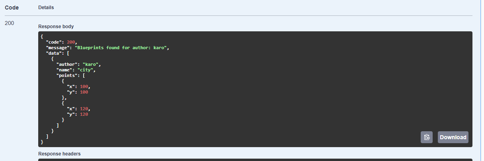
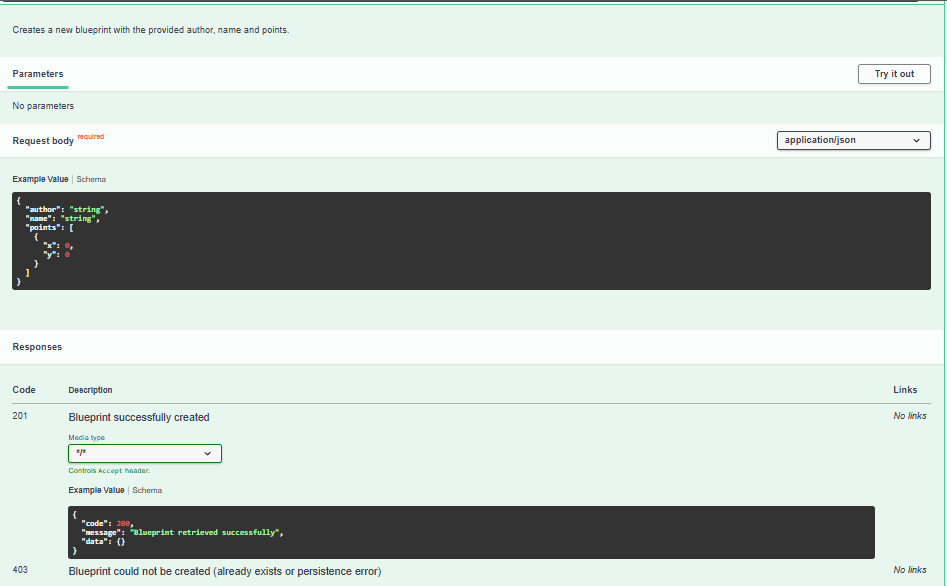
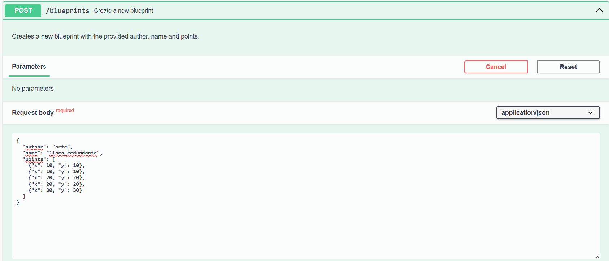
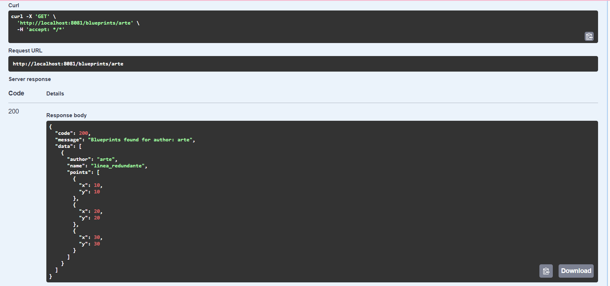
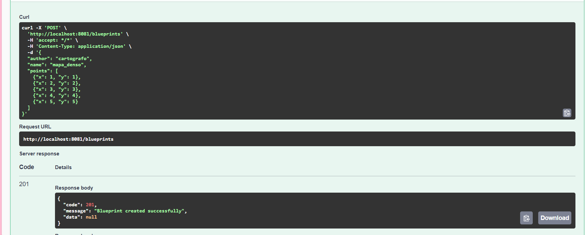
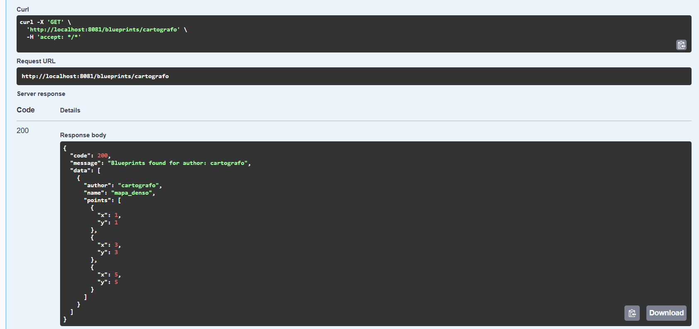
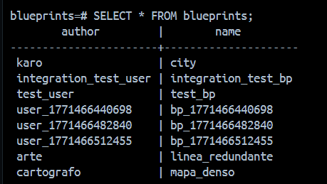

## Laboratorio #4 – REST API Blueprints (Java 21 / Spring Boot 3.3.x)
# Escuela Colombiana de Ingeniería – Arquitecturas de Software  

---

## 📋 Requisitos
- Java 21
- Maven 3.9+

## ▶️ Ejecución del proyecto
```bash
mvn clean install
mvn spring-boot:run
```
Probar con `curl`:
```bash
curl -s http://localhost:8081/blueprints | jq
curl -s http://localhost:8081/blueprints/john | jq
curl -s http://localhost:8081/blueprints/john/house | jq
curl -i -X POST http://localhost:8081/blueprints -H 'Content-Type: application/json' -d '{ "author":"john","name":"kitchen","points":[{"x":1,"y":1},{"x":2,"y":2}] }'
curl -i -X PUT  http://localhost:8081/blueprints/john/kitchen/points -H 'Content-Type: application/json' -d '{ "x":3,"y":3 }'
```

> Si deseas activar filtros de puntos (reducción de redundancia, *undersampling*, etc.), implementa nuevas clases que implementen `BlueprintsFilter` y cámbialas por `IdentityFilter` con `@Primary` o usando configuración de Spring.
---

Abrir en navegador:  
- Swagger UI: [http://localhost:8081/swagger-ui.html](http://localhost:8081/swagger-ui.html)  
- OpenAPI JSON: [http://localhost:8081/v3/api-docs](http://localhost:8081/v3/api-docs)  

---

## 🗂️ Estructura de carpetas (arquitectura)

```
src/main/java/edu/eci/arsw/blueprints
  ├── model/         # Entidades de dominio: Blueprint, Point
  ├── persistence/   # Interfaz + repositorios (InMemory, Postgres)
  │    └── impl/     # Implementaciones concretas
  ├── services/      # Lógica de negocio y orquestación
  ├── filters/       # Filtros de procesamiento (Identity, Redundancy, Undersampling)
  ├── controllers/   # REST Controllers (BlueprintsAPIController)
  └── config/        # Configuración (Swagger/OpenAPI, etc.)
```

> Esta separación sigue el patrón **capas lógicas** (modelo, persistencia, servicios, controladores), facilitando la extensión hacia nuevas tecnologías o fuentes de datos.

---

## 📖 Actividades del laboratorio

```markdown
### 1. Familiarización con el código base
- Revisa el paquete `model` con las clases `Blueprint` y `Point`.  
- Entiende la capa `persistence` con `InMemoryBlueprintPersistence`.  
- Analiza la capa `services` (`BlueprintsServices`) y el controlador `BlueprintsAPIController`.


- **`Blueprint` / `Point`**: Representan el modelo de dominio. Un plano se identifica por autor y nombre, y contiene una colección de puntos.

- **`InMemoryBlueprintPersistence`**: Implementación de la persistencia que almacena los datos en memoria (usando un Map), facilitando pruebas rápidas sin base de datos.

- **`BlueprintsServices`**: Capa de servicios que orquestra la lógica de negocio, conectando el controlador con la persistencia y aplicando filtros.

- **`BlueprintsAPIController`**: Punto de entrada de la API REST que gestiona las peticiones HTTP y retorna respuestas en formato JSON.
```

### 2. Migración a persistencia en PostgreSQL

La capa de persistencia ha sido migrada a **PostgreSQL** usando `JdbcTemplate`. Esta herramienta de Spring simplifica la interacción con la base de datos al gestionar el ciclo de vida de las conexiones y sentencias SQL, permitiendo un mapeo directo entre las filas de la base de datos y los objetos de dominio sin la complejidad de un ORM completo.

Se añadió un esquema en sql (schema.sql) para crear la base de datos y las tablas necesarias.A su vez, 
se implementó la interfaz BlueprintPersistence en BlueprintPersistencePostgres, manteniendo operaciones CRUD que permiten alterar, crear, eliminar y consultar planos guardando esta información en la base de datos postgresql.

#### 🐳 Configuración con Docker
Para ejecutar la base de datos localmente usando Docker:

1. **Iniciar el contenedor de base de datos:**
   ```bash
   docker-compose up -d
   ```
   Esto levantará una instancia de Postgres 14 en el puerto `5432` con la base de datos `blueprints`.

2. **Detener la base de datos:**
   ```bash
   docker-compose down
   ```

#### Variables de Entorno
El proyecto está configurado para usar las siguientes variables de entorno. Si no se definen, usará valores por defecto para desarrollo local (`blueprints_user` / `blueprints_password`):

```markdown
- **BP_DB_NAME**: Nombre de la BD (por defecto: `blueprints`).
- **BP_DB_USER**: Usuario de la BD (por defecto: `blueprints_user`).
- **BP_DB_PASSWORD**: Contraseña (por defecto: `blueprints_password`).
```

**Ejemplo de configuración en PowerShell:**
```powershell
$env:BP_DB_USER="mi_usuario_real"
$env:BP_DB_PASSWORD="mi_secreto_seguro"
docker-compose up -d
mvn spring-boot:run
```

#### Verificación
Para confirmar que los datos persisten:
1. Crea un blueprint vía API.
2. Reinicia la aplicación (`Ctrl+C` y `mvn spring-boot:run`).
3. Consulta el blueprint nuevamente; debería seguir existiendo.
  

### 3. Buenas prácticas de API REST
- Cambia el path base de los controladores a `/api/v1/blueprints`.  
- Usa **códigos HTTP** correctos:  
  - `200 OK` (consultas exitosas).  
  - `201 Created` (creación).  
  - `202 Accepted` (actualizaciones).  
  - `400 Bad Request` (datos inválidos).  
  - `404 Not Found` (recurso inexistente).  
  
- Implementa una clase genérica de respuesta uniforme:
  ```java
  public record ApiResponse<T>(int code, String message, T data) {}
  ```
  Ejemplo JSON:
  ```json
  {
    "code": 200,
    "message": "execute ok",
    "data": { "author": "john", "name": "house", "points": [...] }
  }
  ```

Se ha refactorizado la clase `BlueprintsAPIController` para que todos los endpoints utilicen consistentemente la clase `ApiResponse<T>`. Ahora tanto las respuestas exitosas (`200 OK`, `201 Created`, `202 Accepted`) como los errores controlados (`404 Not Found`, `403 Forbidden`) devuelven un objeto JSON con la estructura estándar `{code, message, data}` y mensajes con el contexto del proyecto.



### 4. OpenAPI / Swagger
- Configura `springdoc-openapi` en el proyecto.  
- Expón documentación automática en `/swagger-ui.html`.  
- Anota endpoints con `@Operation` y `@ApiResponse`.

El proyecto cuenta con la dependencia `springdoc-openapi-starter-webmvc-ui` en el `pom.xml`. La clase `BlueprintsAPIController` tiene todos sus endpoints documentados con annotations `@Operation` (para descripciones) y `@ApiResponses` (para los códigos de estado).
Se puede acceder a la documentación en: `http://localhost:8081/swagger-ui/index.html`


### 5. Filtros de *Blueprints*
- Implementa filtros:
  - **RedundancyFilter**: elimina puntos duplicados consecutivos.  
  - **UndersamplingFilter**: conserva 1 de cada 2 puntos.  
- Activa los filtros mediante perfiles de Spring (`redundancy`, `undersampling`).  

## Activación de Filtros

Para activar los filtros desde terminal se ejecutan los siguientes comandos en PowerShell o CMD dentro de la carpeta raíz del proyecto:

* Filtro Redundancy  
```bash
  mvn spring-boot:run "-Dspring-boot.run.profiles=redundancy" 
  ``` 
  Elimina puntos duplicados consecutivos.

* Filtro Undersampling  
```bash
  mvn spring-boot:run "-Dspring-boot.run.profiles=undersampling"  
  ```
  Conserva 1 de cada 2 puntos (índices 0, 2, 4...).

* Filtro Default  
```bash
  mvn spring-boot:run  
  ```
  No aplica ningún filtro (Identity Filter).

---

## Activación desde application.properties

También puedes activar un filtro editando el archivo src/main/resources/application .properties

Modificando la línea:
```bash
spring.profiles.active=redundancy
```
Y reemplazando el valor por el perfil que se desee utilizar.

## Pruebas en Swagger
Para probar los filtros en swagger se hizo uso de los endpoints POST y GET.

* Para el filtro redundancy se creó un blueprint con puntos duplicados consecutivos y se comprobó que se eliminaron los puntos duplicados consecutivos desde el GET.





* Para el filtro undersampling se creó un blueprint con puntos consecutivos y se comprobó que se conservaron 1 de cada 2 puntos desde el GET.



 


## Evidencia de mensajes en la base de datos
A continuación se observa como las operaciones hechas desde el swagger afectan de forma
directa a la base de datos.



---

# WebSocket con STOMP — Comunicación en Tiempo Real

Se implementa comunicación en tiempo real usando **STOMP sobre WebSocket**, permitiendo que múltiples clientes
colaboren en el mismo blueprint de forma sincronizada.

---

## Configuración del Broker STOMP

**`WebSocketConfig.java`** habilita y configura el broker de mensajería:


| Elemento | Valor | Descripción |
|---|---|---|
| Endpoint de conexión | `/ws-blueprints` | URL donde el cliente abre la conexión WebSocket |
| Prefijo de suscripción | `/topic` | Canal  hacia los clientes |
| Prefijo de envío | `/app` | Prefijo para mensajes que van al servidor |

El cliente se conecta a `/ws-blueprints` y puede suscribirse a ciertos canales bajo `/topic/**` para recibir
actualizaciones en tiempo real.

---

## Controller WebSocket — BlueprintsWSController

Gestiona los mensajes entrantes y retransmite actualizaciones a todos los suscriptores del blueprint afectado.


**Flujo de un mensaje:**

```
Cliente envía a /app/draw
        │
        ▼
 handleDraw(DrawEvent)
        │
        ├── services.addPoint(...)   ← persiste el punto
        │
        └── template.convertAndSend(
                "/topic/blueprints.<author>.<name>",
                BlueprintUpdate
            )                        ← broadcast a suscriptores
```

Cada blueprint tiene su propio tópico con el formato:
```
/topic/blueprints.{author}.{name}
```
Esto hace que solo los clientes viendo ese blueprint específico reciban las actualizaciones.

---

## DTOs utilizados

### DrawEvent — Mensaje entrante

Representa el evento que envía el cliente cuando dibuja un punto.

```java
record DrawEvent(String author, String name, Point point) {}
```

### BlueprintUpdate — Mensaje saliente

Mensaje que el servidor retransmite a todos los clientes suscritos.
```java
record BlueprintUpdate(String author, String name, Point point) {}
```

Contiene la misma información del evento para que los clientes puedan renderizar el nuevo punto en el canvas compartido.

---

## Resumen del flujo completo

```
[Cliente A dibuja]
      │
      │  STOMP /app/draw  →  DrawEvent
      ▼
[BlueprintsWSController]
      │
      ├─ Persiste en BlueprintsServices
      │
      │  /topic/blueprints.author.name  →  BlueprintUpdate
      ▼
[Cliente A] ← recibe actualización
[Cliente B] ← recibe la misma actualización
[Cliente N] ← recibe la misma actualización
```


## ✅ Entregables

1. Repositorio en GitHub con:  
   - Código fuente actualizado.  
   - Configuración PostgreSQL (`application.yml` o script SQL).  
   - Swagger/OpenAPI habilitado.  
   - Clase `ApiResponse<T>` implementada.  

2. Documentación:  
   - Informe de laboratorio con instrucciones claras.  
   - Evidencia de consultas en Swagger UI y evidencia de mensajes en la base de datos.  
   - Breve explicación de buenas prácticas aplicadas.  

---

## 📊 Criterios de evaluación

| Criterio | Peso |
|----------|------|
| Diseño de API (versionamiento, DTOs, ApiResponse) | 25% |
| Migración a PostgreSQL (repositorio y persistencia correcta) | 25% |
| Uso correcto de códigos HTTP y control de errores | 20% |
| Documentación con OpenAPI/Swagger + README | 15% |
| Pruebas básicas (unitarias o de integración) | 15% |

**Bonus**:  

- Imagen de contenedor (`spring-boot:build-image`).  
- Métricas con Actuator.  